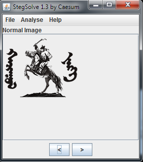
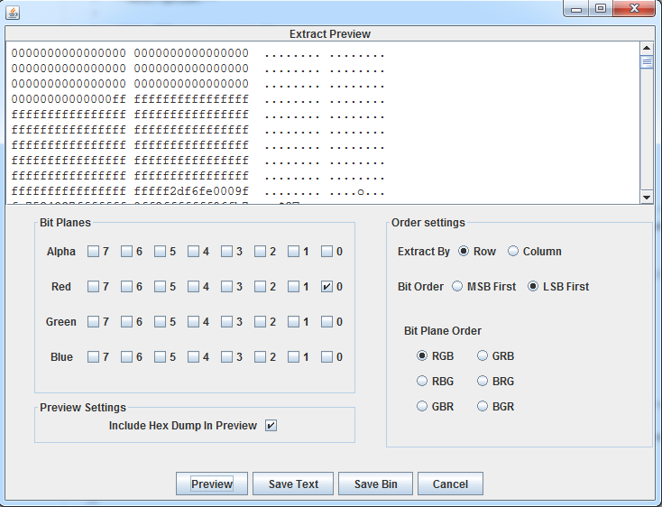
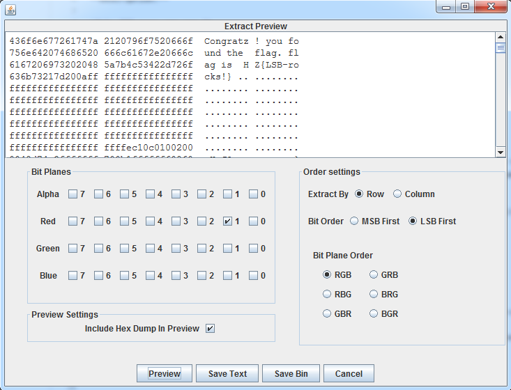

# Haruulzangi 2018 Round 1 : Least Significant Bit

**Category:** Crypto
**Points:** 944
**Solves:** 6
**Description:**

>Only RED eyes can see it
>
>link [challenge.png](challenge.png)
>
>--
>reamb

## Write-up

 Least Significant Bit гэсэн даалгаврын нэрнээс энэ даалгавар дээр хийх цаашдын алхам тодорхой болж өгнө. `[LSB](http://ijact.org/volume3issue4/IJ0340004.pdf)` ийн талаар жаахан `Google` двэл энэ даалгавар нь Stegno даалгавар болох нь тодохой болно. 

Stegno зурагтай даалгавар дээр түгээмэл ашигладаг нэг түүл бол `[StegSolve](https://github.com/eugenekolo/sec-tools/tree/master/stego/stegsolve)` билээ. 

Үүн дээр зүргыг нээж харвал. 

Бид layer дээр биш bit дээр нуусан data хайх гэж байгаа болохоор `Analyze -> Data Extract` дээр ажиллана. 

`Only RED eyes can see it` гэсэн тайлбар нь нэгийг хэлж байна. үүнээс бид RGB-н RED 0 бит дээр эхлээд мэдээлэл байгаа хэсгийг шалгаж үзье

эндээс онц юм харагдахгүй байна. тэгвэл RGB -н   1 бит дээр шалгаж үзье.

>DAANG!!!  flag `HZ{LSB-rocks!}`

 ## Other write-ups and resources

* none yet

